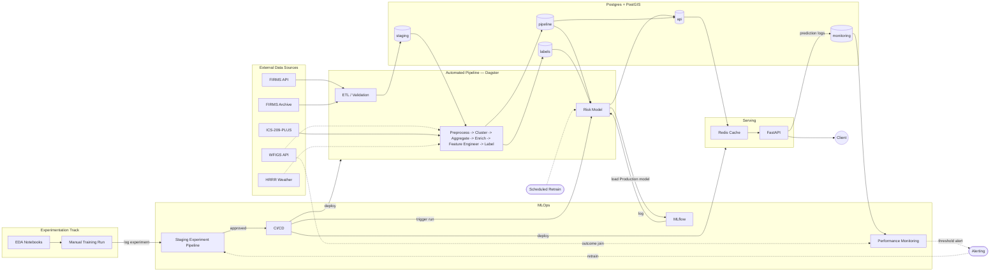
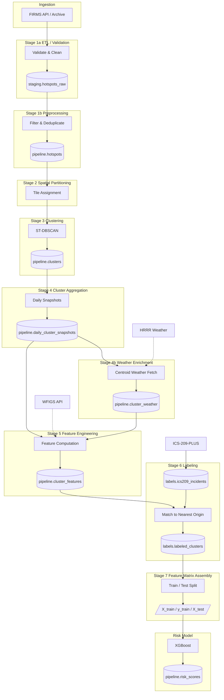
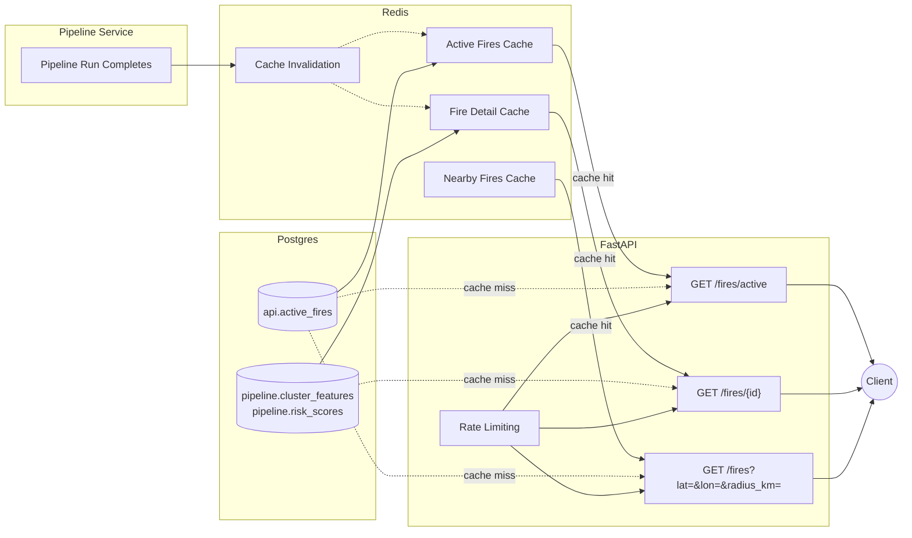

# Architecture/Design Decisions

Some of my current thinking/brain-dump (current as in before actually implementing most of this, so much of this is subject to change) on how the overall system might look like and some reasoning for certain design decisions. Goal of this document isn't to create the final system and architecture plans, but more so just to get the ideas flowing and start to nail down some of the specifics - so if something doesn't seem exactly correct, you're probably right and I haven't given that exact part enough thought yet. Most of this is likely to change once I get out of the EDA phase and get to creating the pipelines. Overall, the goal of this project is to have fun while looking into some things I haven't had direct work experience with and try to create a "production" like prediction service.

---

## System Overview

The system at a very wide view, which is for a near-real-time wildfire risk system that ingests satellite hotspot detections from NASA FIRMS, clusters them into fire events using spatiotemoral methods, scores the clustered events with a trained ML risk model, and serves the prediction through a REST API. 

---

## Data Engineering Pipeline Stages

---

## Serving Layer

---

## Design Decisions

### Modular Monolith

-  I was debating on going with a monolithic or microservice architecture, considering microservice because I haven't fully implmented one ina project at this complexity before. However, as I work more on this project, the scope creep has started to set in and I am getting too ahead of myself with some these ideas.
- So to quell the creep, I decided to go a bit of middle ground and go with a modular monolith. Also sticking with monolith since the scale of this project overall doesn't justify the operational overhead of separate services (at least for now, maybe in the future I'll look into going more of a microservice route once more of the project is fleshed out).
- Modular meaning each stage has defined input/output contracts, no shared state, and independently testable and replaceable.
- Modular because again, trying to not scope creep and have this project turn into monolithic coupling mess - still need to consider some software principles like SOLID/KISS.
- Plus, with this modular thinking and with the help of some of the pipeline orchestrators can help out with the benefits that would come with being a microservice, like Dagster (independent re-runs, failure isolation, etc..). So having strict network boundaries like in a microservice would add overhead with little to no payoff at this scale.

### Orchestration

- The main orchestrators I'm considering are Airflow, Prefect, and Dagster. Given some thought, my choice is split between Airflow and Dagster (Prefect is also viable, but I'm leaning towards these two). Airflow because of the large community and support, maturity, and scheduling. Dagster because of the focus on assest abstraction. 
- I'm deciding to go with Dagster because the pipelines in this project are geared towards ETL/ELT/ML work, which works well with the assest abtraction. Since each stage is independent, it will produce a typed data artifact as output. This fits perfectly with Dagster since Dagster will treat each stage's output as a named/versioned artifact that can be rematerialized independently. I see this being very benficial for cases when logic in a downstream stage changes, requiring a re-run from that stage (and downstream). However using Dagster, upstream stages don't need to be re-ran since their artifacts haven't changed. Considering I will be working with historical and real time data, the size of the data is large and will continue to grow, this ability to not have to re-run upstream stages is quite valuable. 
- While Airflow is probably a better choice in a more balanced comparison, especially if this was a large scale project serving many users, Dagster seems perfectly fine for this and has less setup overhead. Plus, I've never used Dagster so it's a new learning oportunity for me.

### Data Store

- Since this project is dealing with primarily geospatial data, Postgres with PostGIS is the natural choice for data storage. PostGIS provides geomtry types, spatial indexes and built-in functions needed to do needed work at the database layer, rather than having to pull this data into Python for every operation - following the principle of bringing the code to the data rather than data to code since data is larger in this case. 
- This part is very much subject to change, but my initial planning idea is to split the database into five schema (staging, pipeline, labels, api, and monitoring) where each has a single and clearly defined role, making data flow explicit and prevents and cross-contamination. 
    - `staging` holds the append-only raw ingest
    - `pipeline` holds cleaned and transformed artifacts
    - `labels` holds ground truth
    - `api` holds materialized views optimized for reads
    - `monitoring` handles the feedback loop
- Lastly, Redis will sit in front of Postgres at the api layer for two main reasons:
    - the pipeline will run on a ~3 hour cadence (that is how frequent the NASA VIIRS satellite makes a pass over an area) and the underlying data doesn't change between runs, so repeated reads on some `GET` of the fire data will return identical results for up to 3 hours. Fire season would also see spikes in traffic for information that hasn't changed in a 3 hour window, so Redis is a good case for optimization.
    - and simply, since this project is for fun and to get better familiarity of these tools and frameworks, I want better familiarity with Redis in a "production"-like setup.

### MLOps

MLFlow was chosen for experiment tracking and model registry since it is self-hosted, open source, and works well with the Docker setup and Postgres/Redis without needing any external service to couple this all together. Other options are W&B or Neptune, which have their pros over MLflow, but have many features and scaling in paid tiers. MLFlow meets the needs for this project such as the model registry lifecyle needed for automated promotion. The MLflow run ID will be stored as a model version for the computed prediction risk scores, meaning there'll be good traceability for what was used to create a prediction value (things like artifacts, training data, hyperparameters, eval metrics).

Model promotion will run entirely through CI/CD. The `dev` enviroment will be purely for local development/EDA. The `staging` environment will have an experimental pipeline that handles data validation/preparation and training/eval for a candidate model, then feeds back into itself running hyperparameter tuning until a best model is found within a given set of parameters. This model then moves into a `production` deployement pipeline which runs the same data data validation/preparation work with the optimized hyperparameters on production data and evaluating on the held out testing dataset, and lastly added to the model registry in MLflow. Best performing model gets promoted to serve predictions. 

Ground truth labels arrive at a delayed rate (need to figure out the cadence for this) which confirms whether a predicted high-risk cluster was actually declared a fire. A scheduled Dagster job (cadence TBD) fills in outcome labels retroactively. The realized precision is then computed from the updated true outcomes agaisnt the predicted outcomes. If the precision falls below a specified threshold for a consective amount of time, then an alert is made for human review. 

Retraining will have three triggers:
- a scheduled automated retrain on a fixed cadence (roughly every couple of months or so via a Dagster job)
- a performance-based retrain triggered from the fall in realized precision
- a human-initiated retrain available at any for cases like new data or catching something the automated missed

---

## One Small Favour

I've been thinking about the labeling strategy and it is the weakest link in the whole plan. I kind of already knew this going in but just wanted to get started with something. ICS-209 coverage stops at 2020, which means there's no ground truth for anything after that (which I had planned for 2023 to be a held out test year), and more importantly no way to do the retroactive outcome labeling I had planned for MLOps once the service is actually live. The whole realized precision loop depends on getting updated truth values over time, and this dataset is a frozen research compilation that does not get updated frequently.

I looked into WFIGS as a replacement since it's more than just perimeters: there's a live layer (refreshed about every 5 min, has discovery date + point of origin) that I've only been thinking of using for perimeters. This would fix the currency problem, but not the actual problem of "got assigned an incident number", which is still a human threshold just a lower one than ICS-209's reporting benchmark. So this is not good either.

So I'm leaning toward dropping the whole binary "became a reportable incident" target and reframing the label as something derived purely from the FIRMS detection history itself (e.g. predicting escalation magnitude based on detection count, total FRP, cluster area at T+24h, T+48h, etc..) instead of a declared incident flag. This would be a self-supervised method based on the FIRMS data, which doesn't have an end date (and has a large and easily accessible history), sidesteps the whole class imbalance problem since it's a continuous target instead of a ~1-5% positive rate, and quashes the ICS-209/WFIGS dependency instead of just swapping in a better matched labeing dataset. ICS-209/WFIGS would probably still be useful as enrichment features, just not as the label source. Still just brainstorming, haven't revisited the train/test split or any of the modeling logic yet.

---

## Some more things to think about but not sure right now

| Decision | Options | Status |
|---|---|---|
| WFIGS perimeter storage | Store in DB vs fetch live each run | Open |
| MLflow hosting | Self-hosted Docker vs managed service | Open |
| Cloud provider | GCP / AWS / single VM | Open |
| Container orchestration | Kubernetes vs Docker Compose on a single VM | Open |
| Model CI trigger | Dagster / training script / manual trigger | Open |
| Retraining precision threshold | Placeholder 0.50 | Revisit after some system testing |
| HRRR precipitation signal | Keep two-fetch HRRR vs. drop precip and switch to RTMA (2.5 km analysis) | Open, test during modeling |
